# 基于Springboot的教师工作量管理系统

## Springboot-0031


## 技术栈

Springboot mybatisplus vue mysql maven


## 数据库表(8张)


## 功能介绍

```properties
系统管理员功能有个人中心，教师管理，分类信息管理，课程信息管理，工作量管理，系统管理等。

教师功能有个人中心，课程信息管理，工作量管理。
```


## 图片

### 前台


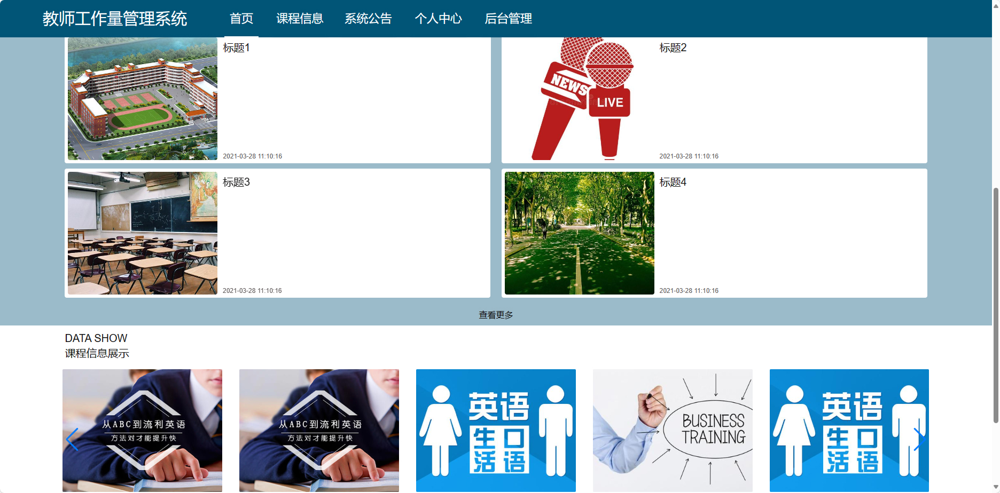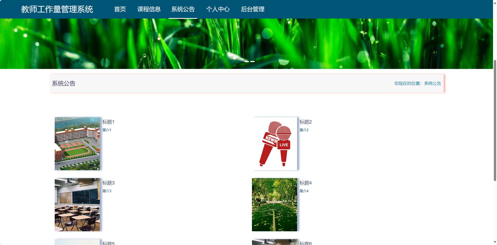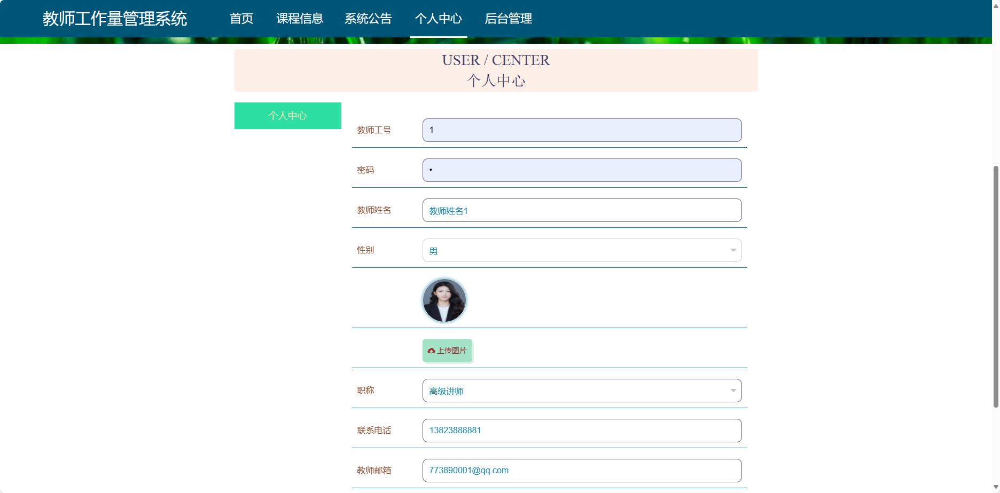

### 后台

### 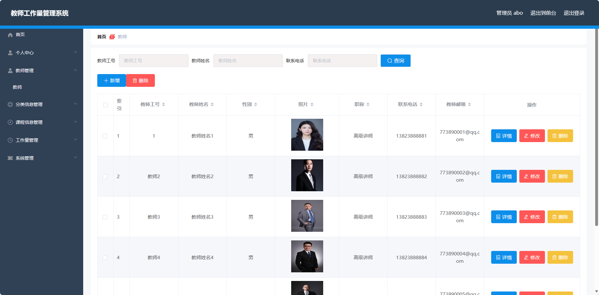

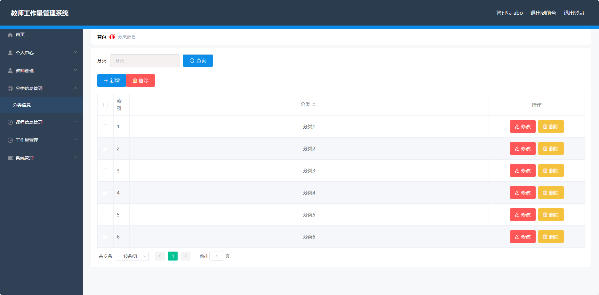

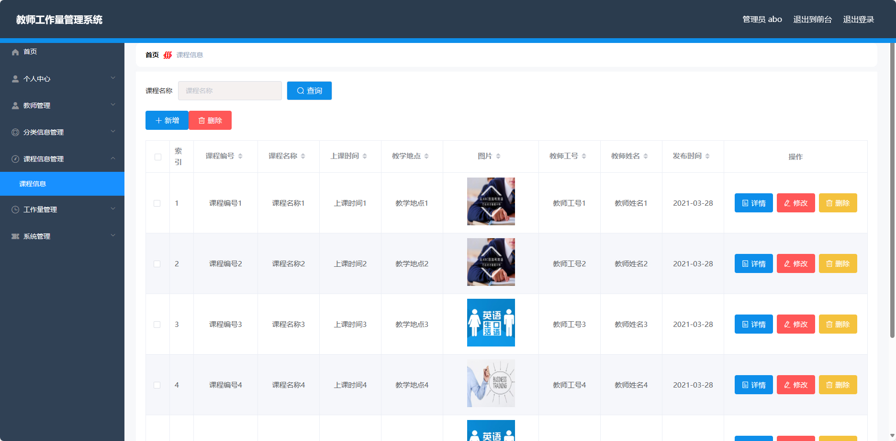

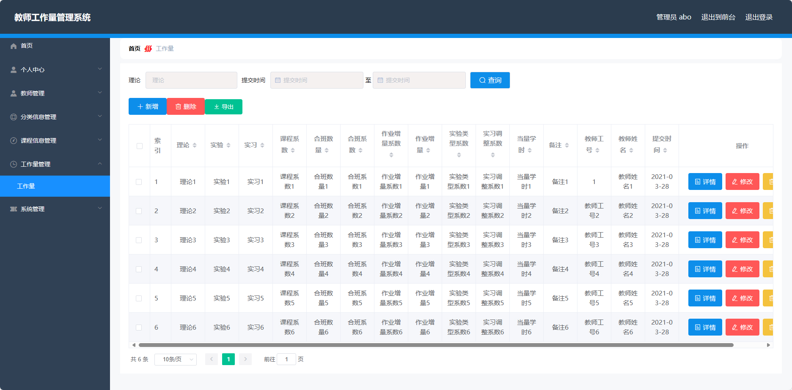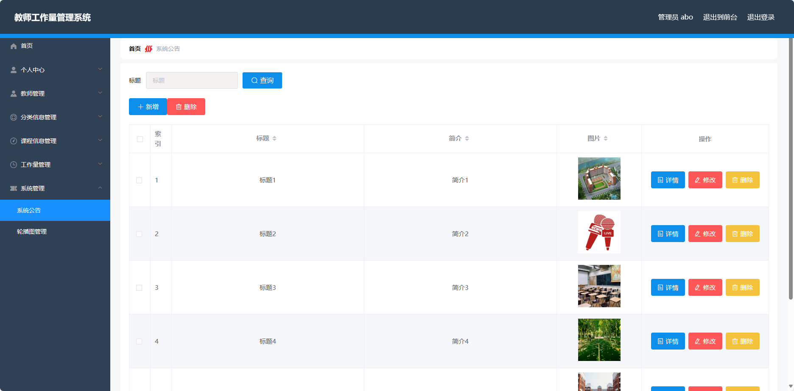

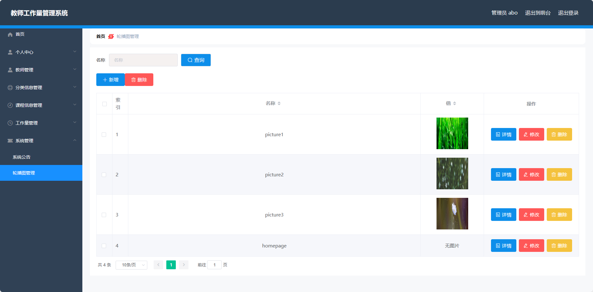


## 访问路径

### 前台

```properties
http://localhost:8080/springbootrpj39/front/pages/login/login.html

账号 1
密码 1
```

### 后台

```properties
http://localhost:8080/springbootrpj39/admin/dist/index.html#/login

账号 abo
密码 abo
```


## 功能图

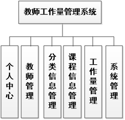


## 文档目录

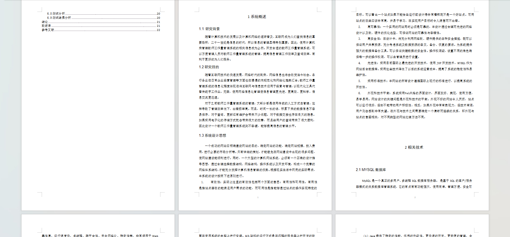


## 打赏或交流


